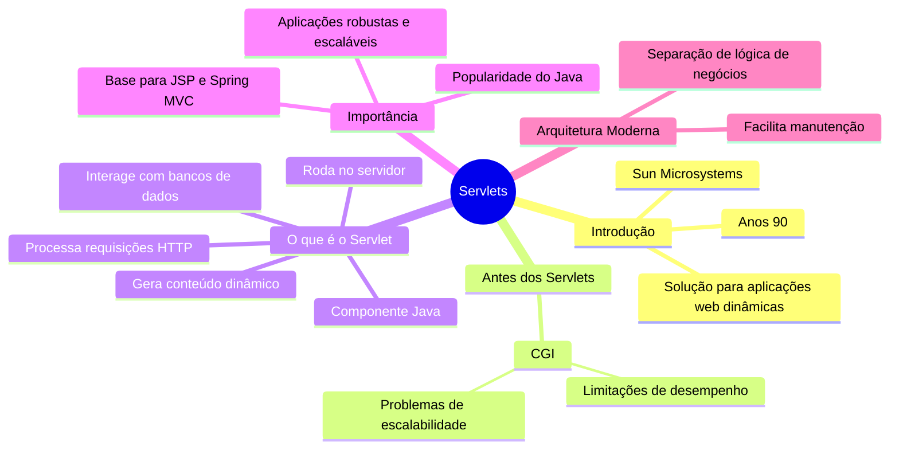

# Criando a Primeira Servlet: Uma Revolução no Desenvolvimento Web

## 1. Introdução à Tecnologia Servlet

A tecnologia Servlet foi introduzida pela Sun Microsystems em meados dos anos 90 como uma solução para criar aplicações web dinâmicas em Java. Antes dos Servlets, a criação de conteúdo dinâmico na web era um processo mais complicado e menos eficiente, muitas vezes envolvendo CGI (Common Gateway Interface), que tinha suas limitações em termos de desempenho e escalabilidade.

## 2. O Cenário Antes dos Servlets

### 2.1 Limitações do CGI

Antes do advento dos Servlets, a criação de conteúdo dinâmico na web era frequentemente realizada através do Common Gateway Interface (CGI). O CGI permitia que os servidores web executassem programas externos para gerar conteúdo dinâmico. No entanto, essa abordagem tinha várias limitações:

- **Desempenho**: Cada requisição de usuário resultava na criação de um novo processo no servidor, o que consumia muitos recursos e limitava o número de requisições que o servidor podia processar simultaneamente.
- **Escalabilidade**: Devido ao alto consumo de recursos, os servidores tinham dificuldade em lidar com um grande número de requisições simultâneas, o que limitava a escalabilidade das aplicações web.
- **Manutenção**: A manutenção de scripts CGI era complexa, especialmente em aplicações grandes, devido à falta de separação clara entre a lógica de negócios e a apresentação.

### 2.2 História e Uso do CGI

O Common Gateway Interface (CGI) é uma tecnologia que permite a comunicação entre um servidor web e programas externos, que são executados para gerar conteúdo dinâmico em resposta a solicitações de usuários. Introduzido no início dos anos 1990, o CGI foi uma das primeiras maneiras de criar páginas web dinâmicas, antes do surgimento de tecnologias mais modernas como Servlets, JSP, PHP e outras.

#### 2.2.1 Origem e Funcionamento

- **Origem**: CGI foi desenvolvido para permitir que servidores web executassem programas externos e gerassem conteúdo dinâmico. Isso foi uma evolução significativa em relação às páginas web estáticas.

- **Funcionamento**: Quando um servidor web recebe uma solicitação para um recurso que é um script CGI, ele executa o script como um processo separado. O script gera uma resposta dinâmica, que é então enviada de volta ao cliente.

#### 2.2.2 Evolução para Servlets

- **Limitações do CGI**: Cada solicitação de usuário resultava na criação de um novo processo no servidor, consumindo muitos recursos, especialmente em servidores com alto tráfego.

- **Vantagens dos Servlets**: Os Servlets são carregados uma única vez na memória do servidor e podem atender a múltiplas requisições sem a necessidade de criar novos processos para cada solicitação, resultando em melhor desempenho e maior escalabilidade.

## 3. Entendendo os Servlets

Um Servlet é um componente Java que roda no servidor e gera conteúdo dinâmico para um cliente web, geralmente um navegador. É parte da especificação Java EE (Enterprise Edition) e é executado dentro de um contêiner de servlets, como Apache Tomcat ou Jetty.

### 3.1 Funcionalidades dos Servlets

- Processam requisições HTTP
- Manipulam dados de formulários
- Gerenciam sessões de usuário
- Interagem com bancos de dados

### 3.2 Importância dos Servlets

A importância dos Servlets reside na sua capacidade de criar aplicações web robustas e escaláveis. Eles são a base para muitas outras tecnologias Java para web, como JSP (JavaServer Pages) e frameworks como Spring MVC. Com o advento dos Servlets, os desenvolvedores puderam criar aplicações web mais eficientes, seguras e fáceis de manter, o que contribuiu significativamente para a popularidade do Java no desenvolvimento de aplicações web.

### 3.3 Arquitetura de Aplicações Web Modernas

Os Servlets são fundamentais para a arquitetura de aplicações web modernas, permitindo a separação clara entre a lógica de negócios e a apresentação, o que facilita a manutenção e evolução das aplicações ao longo do tempo.

---