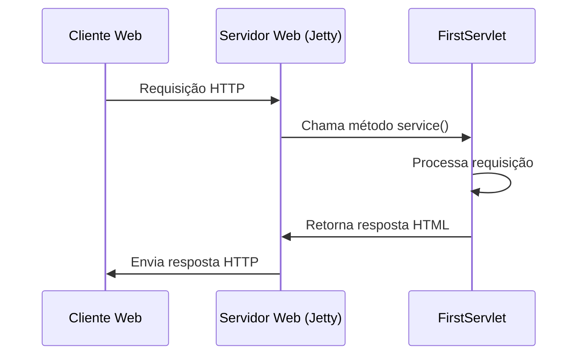

# Mão na enxada


## 1. Configuração Inicial

### 1.1 Adicionando Dependências

Para iniciar nosso projeto, precisamos importar as dependências necessárias no arquivo `pom.xml`. Adicione o seguinte código dentro da tag `<dependencies></dependencies>`:

> Nota: Você pode encontrar a versão mais recente desta dependência no [Maven Repository](https://mvnrepository.com/artifact/javax.servlet/javax.servlet-api/3.1.0).
> {style="note"}

```xml
<!-- https://mvnrepository.com/artifact/javax.servlet/javax.servlet-api -->
<dependency>
    <groupId>javax.servlet</groupId>
    <artifactId>javax.servlet-api</artifactId>
    <version>3.1.0</version>
    <scope>provided</scope>
</dependency>
```

Após adicionar a dependência, recarregue o Maven pressionando <kbd>CTRL</kbd> + <kbd>SHIFT</kbd> + <kbd>O</kbd> ou clicando no ícone do Maven no lado direito da tela.

### 1.2 Sobre o `servlet-api`

O `javax.servlet-api` é uma biblioteca Java crucial para o desenvolvimento de aplicações web dinâmicas. Ela fornece as classes e interfaces necessárias para implementar o padrão de arquitetura Servlet.

#### História e Evolução:
- Introduzido pela Sun Microsystems nos anos 1990
- Desenvolvido como uma alternativa ao CGI para criar aplicações web dinâmicas
- Parte integrante da especificação Java EE (Enterprise Edition)

#### Funcionalidades Principais:
- Processamento de requisições HTTP
- Manipulação de dados de formulários
- Gerenciamento de sessões de usuário
- Interação com bancos de dados

#### Classes e Interfaces Importantes:
- `HttpServlet`
- `HttpServletRequest`
- `HttpServletResponse`

## 2. Estrutura do Projeto

### 2.1 Criando a Estrutura de Pacotes

1. Crie um novo pacote:
   - Clique com o botão direito na pasta `java`
   - Selecione `New > Package`

   

2. Nomeie o pacote:

   

3. Crie uma nova classe Servlet:
   - Clique com o botão direito no pacote criado
   - Selecione `New > Java Class`

   

4. Nomeie a classe (ex: `FirstServlet`):

   

### 2.2 Implementando o Servlet

Faça sua classe herdar de `HttpServlet` e sobrescreva o método `service`:

```java
import javax.servlet.ServletException;
import javax.servlet.http.HttpServlet;
import javax.servlet.http.HttpServletRequest;
import javax.servlet.http.HttpServletResponse;
import java.io.IOException;

public class FirstServlet extends HttpServlet {
    @Override
    protected void service(HttpServletRequest request, HttpServletResponse response) throws ServletException, IOException {
        // Implementação do método service
    }
}
```

#### 2.2.1 Detalhamento do Método `service`

O método `service` é fundamental em um Servlet:

- **Assinatura**: `protected void service(HttpServletRequest request, HttpServletResponse response) throws ServletException, IOException`
- **Parâmetros**:
  - `HttpServletRequest request`: Encapsula detalhes da requisição HTTP
  - `HttpServletResponse response`: Usado para construir a resposta ao cliente
- **Exceções**:
  - `ServletException`: Erros na execução do Servlet
  - `IOException`: Erros de entrada/saída

#### 2.2.2 Implementação Básica

```java
@Override
protected void service(HttpServletRequest request, HttpServletResponse response) throws ServletException, IOException {
    PrintWriter writer = response.getWriter();
    writer.println("<html><body><h1>Hello, Universe!</h1></body></html>");
}
```

## 3. Configuração do Servlet: Voltando ao projeto

### 3.1 Configurando o `web.xml`

Atualize o arquivo `web.xml` em `webapp/WEB-INF/` para a versão mais recente:

```xml
<web-app xmlns="http://xmlns.jcp.org/xml/ns/javaee"
         xmlns:xsi="http://www.w3.org/2001/XMLSchema-instance"
         xsi:schemaLocation="http://xmlns.jcp.org/xml/ns/javaee
         http://xmlns.jcp.org/xml/ns/javaee/web-app_3_1.xsd"
         version="3.1">

    <servlet>
        <servlet-name>firstServlet</servlet-name>
        <servlet-class>universe.punkdomus.FirstServlet</servlet-class>
    </servlet>

    <servlet-mapping>
        <servlet-name>firstServlet</servlet-name>
        <url-pattern>/firstServlet</url-pattern>
    </servlet-mapping>

</web-app>
```

### 3.2 Compatibilidade com Jetty 11

Para a versão 11 do Jetty, adicione a dependência do Jakarta Servlet API no `pom.xml`:

```xml
<dependency>
    <groupId>jakarta.servlet</groupId>
    <artifactId>jakarta.servlet-api</artifactId>
    <version>5.0.0</version>
    <scope>provided</scope>
</dependency>
```

## 4. Fluxo de Requisição


