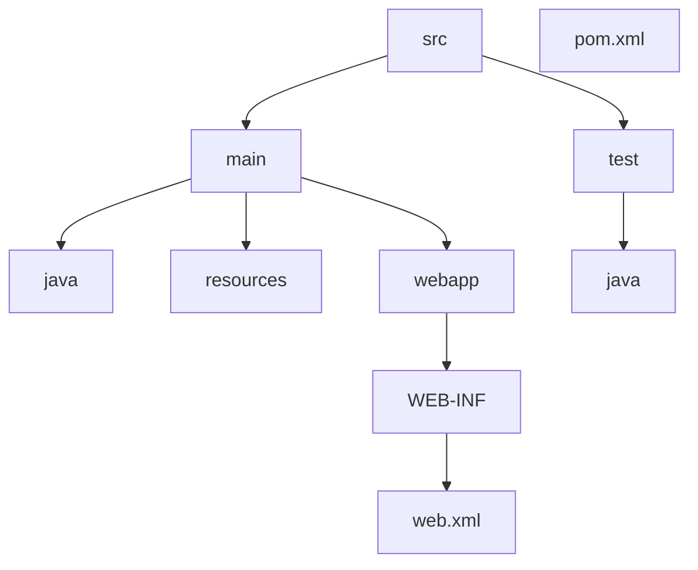

# Learn Servlet - Módulo 1: Configuração Inicial do Projeto

## 1. Criando o Projeto Maven Archetype no IntelliJ

Para iniciar nosso projeto de aplicação web Java, vamos usar o Maven Archetype no IntelliJ IDEA.


### 1.1 Passo a Passo para Criação do Projeto

1. Abra o IntelliJ IDEA
2. Clique em "New Project"
3. Selecione "Maven" na lista de opções à esquerda
4. Escolha o archetype "maven-archetype-webapp"
5. Preencha os campos de GroupId, ArtifactId e Version
6. Clique em "Next" e siga as instruções para finalizar a criação do projeto

## 2. Estrutura de Pastas do Projeto

Após a criação, o Maven gera uma estrutura de pastas padrão para aplicações web.


### 2.1 Criando a Pasta 'java'

É necessário criar manualmente a pasta 'java' para armazenar o código-fonte da aplicação.


Para criar a pasta 'java':
1. Clique com o botão direito na pasta 'main'
2. Selecione "New > Directory"
3. Digite "java" e pressione Enter

### 2.2 Entendendo a Estrutura do Projeto

A estrutura completa do projeto inclui:



- **src/main/java**: Código-fonte Java da aplicação
- **src/main/resources**: Arquivos de configuração e recursos
- **src/main/webapp**: Arquivos web (HTML, CSS, JS, JSP)
- **src/main/webapp/WEB-INF**: Configurações do aplicativo web
- **src/test/java**: Testes unitários
- **pom.xml**: Configuração do Maven

## 3. Configuração do Servidor

Para executar nossa aplicação web, precisamos de um servidor.

### 3.1 Tipos de Servidores

Existem dois tipos principais de servidores para nossa aplicação:

1. **Servidores Robustos**: Com muitas funcionalidades do Java EE
2. **Servidores Leves**: Com funcionalidades básicas, ideais para projetos menores

### 3.2 Instalando o Plugin Jetty

Vamos usar o Jetty, um servidor leve e eficiente. Adicione o seguinte ao `pom.xml`:

```xml
<build>
    <finalName>despesas-web</finalName>
    <plugins>
        <plugin>
            <groupId>org.eclipse.jetty</groupId>
            <artifactId>jetty-maven-plugin</artifactId>
            <version>11.0.24</version>
        </plugin>
    </plugins>
</build>
```

### 3.3 Atualizando Dependências

Após adicionar o plugin, atualize as dependências do Maven:


Pressione <kbd>CTRL</kbd> + <kbd>SHIFT</kbd> + <kbd>O</kbd> para atualizar.

### 3.4 Executando o Servidor

Após a configuração:

1. Clique em "Run"
2. Acesse `http://localhost:8080/` no navegador


> Nota: A porta padrão do Jetty é 8080, mas pode ser alterada se necessário.
> {style="warning"}

## 4. Definindo Contextos

Para configurar o contexto da aplicação, adicione o seguinte ao `pom.xml`:

```xml
<plugins>
  <plugin>
    <groupId>org.eclipse.jetty</groupId>
    <artifactId>jetty-maven-plugin</artifactId>
    <version>11.0.24</version>
    <configuration>
      <webApp>
        <contextPath>/expenses-web</contextPath>
      </webApp>
    </configuration>
  </plugin>
</plugins>
```

Isso define o caminho de contexto da aplicação como `/expenses-web`.
